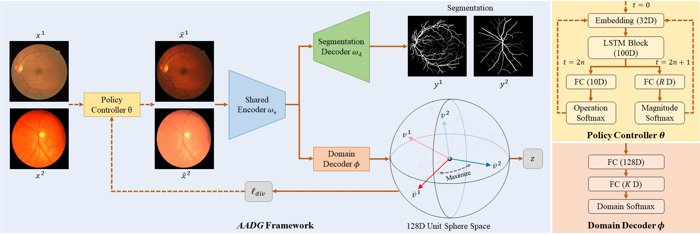

# AADG

By Junyan Lyu, Yiqi Zhang, Yijin Huang, Li Lin, Pujin Cheng, Xiaoying Tang.

This repository contains an official implementation of AADG for the TMI paper ["AADG: Automatic Augmentation for Domain Generalization on Retinal Image Segmentation"](https://ieeexplore.ieee.org/document/9837077).



## Quick start

### Environment

This code is developed using on **Python 3.8.5** and Pytorch 1.8.0 on CentOS 7 with NVIDIA GPUs. Training and testing are performed using 1 Tesla A100 GPU with CUDA 11.1. Other platforms or GPUs are not fully tested.

### Install

1. Install Pytorch
2. Install dependencies

```shell
pip install -r requirements.txt
```
3. Replace `<ENV>/lib/python3.8/site-packages/segmentation_models_pytorch/base/heads.py` in your python environment with `models/heads.py` provided in this repository.
4. Make sure your gcc, cmake and cuda versions are compatitable with [pykeops](https://www.kernel-operations.io/keops/python/installation.html).

### Data

1. Make a `dataset` directory.

```shell
cd AADG
mkdir dataset
```

2. Download the [OD/OC datasets](https://drive.google.com/file/d/1p33nsWQaiZMAgsruDoJLyatoq5XAH-TH/view?usp=sharing) into `dataset`.
3. Download the [retinal vessel datasets](https://drive.google.com/drive/folders/14j_Wub88ldKDddD8foszYXtRMb1Mqo-u?usp=sharing) into `dataset`.
4. Your `dataset` directory should look like this:

````
AADG
-- dataset
   |-- RVS
   |   |-- CHASEDB1
   |   |-- DRIVE
   |   |-- HRF
   |   |-- STARE
   |-- Fundus
   |   |-- Domain1
   |   |-- Domain2
   |   |-- Domain3
   |   |-- Domain4  

````

### Train

Please specify the configuration file in ```experiments```.

```shell
python run.py --cfg <CONFIG-FILE> --output_dir <CUSTOM-OUTPUT-DIR>
```

For example,

```shell
python run.py --cfg experiments/rvs_sinkhorn/diversity_ex.yaml --output_dir output/
```

## Citation
If you find this repository useful, please consider citing AADG paper:

```
@ARTICLE{9837077,
  author={Lyu, Junyan and Zhang, Yiqi and Huang, Yijin and Lin, Li and Cheng, Pujin and Tang, Xiaoying},
  journal={IEEE Transactions on Medical Imaging}, 
  title={AADG: Automatic Augmentation for Domain Generalization on Retinal Image Segmentation}, 
  year={2022},
  volume={},
  number={},
  pages={1-1},
  doi={10.1109/TMI.2022.3193146}}
```
